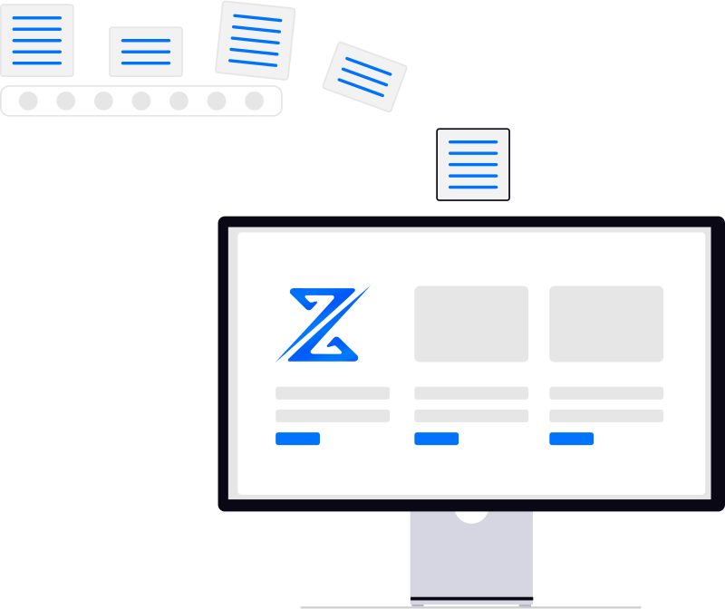

<h1 align="center">Hi 👋, I'm Hussein Mayhoub</h1>
<h3 align="center">Back-End Developer & Information Systems Student</h3>

  

---

- 🔭 **I’m currently working on:** **[Smartz](https://github.com/teamsmartz)**

 

- 🎓 **Education:** Information Systems & Programming at College of Innovative Technologies & Entrepreneurship (КИТП)

 

- 🚀 **Main Focus:** Back-End Development with **Node.js, Express & MongoDB**

 

- 🛠️ **Foundations:** C#, C++, PHP, MySQL, Networking & System Administration

---

### 🛠️ Languages and Tools:

  
  
  
  
  
  
  
  
  
  
  

---

### 📊 GitHub Overview:

  
  

